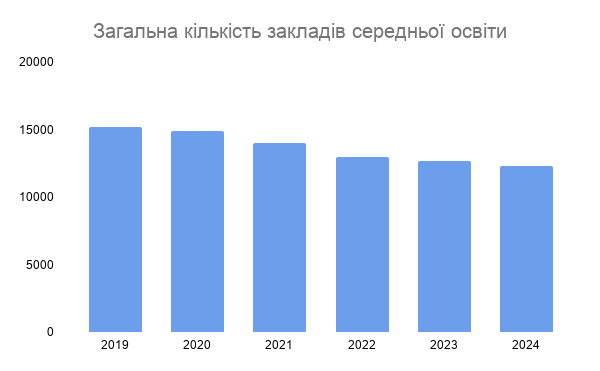
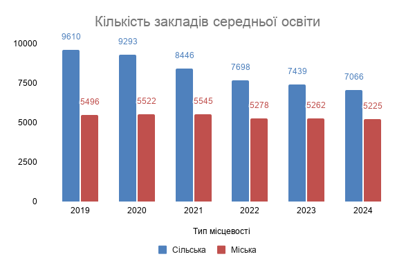
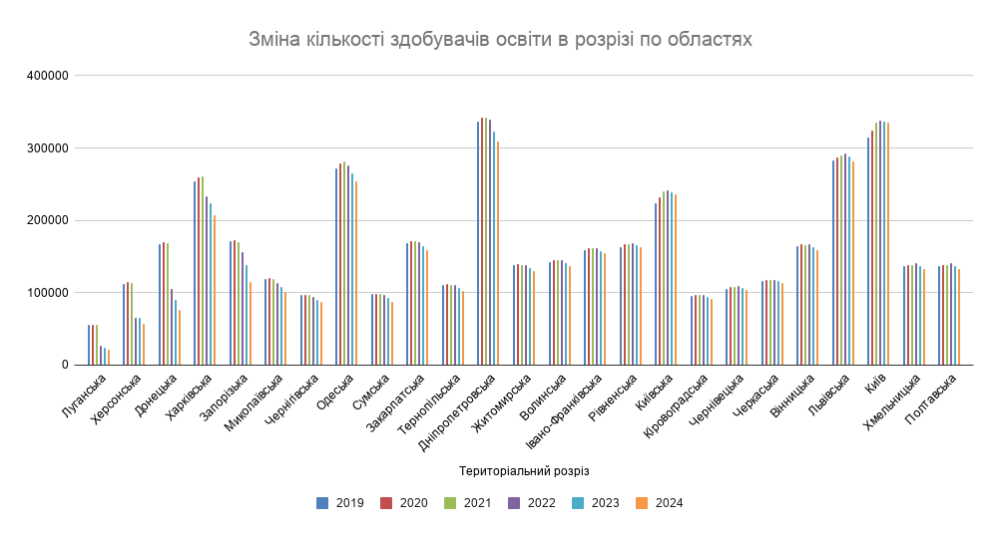
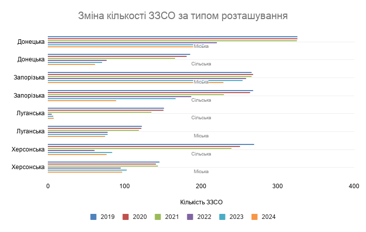

# Куди зникають школи: чому за 5 років Україна втратила кожен п’ятий заклад освіти?
2019-2024 роки

## Ключові інсайти:
Мережа шкіл скорочується швидше, ніж кількість учнів: –19% закладів проти –9,5% учнів - відбувається укрупнення освітньої інфраструктури.

Кількість ЗЗСО* скорочується непропорційно швидко: –26,5% шкіл у селах проти –5% у містах - структурний зсув у бік міських центрів.

Регіональний розрив посилюється: схід демонструє різке падіння (до –70%), тоді як захід і центр залишаються відносно стабільними, а м. Київ зростає.

Повномасштабна війна різко прискорила існуючі тенденції, але не є їх першопричиною — скорочення мережі почалося ще до 2022 року.

Освітня політика сприяє концентрації ЗЗСО: оптимізація мережі та вимоги до наповнюваності формують перехід від малих шкіл до опорних закладів.

За даними, отриманими з відкритого реєстру Банку даних https://stat.gov.ua/uk/explorer, з 2019 по 2024 в Україні зменшилася загальна кількість закладів середньої освіти на 19% (з 15194 ЗЗСО до 12291 ЗЗСО). З них: кількість закладів місцевого типу на 5%, а сільського типу на 26.5%. 

## 📊 Динаміка кількості ЗЗСО

*Рис. 1. Зменшення кількості шкіл у 2019–2024 роках*

*Рис. 2. Зменшення кількості шкіл у 2019–2024 роках за типом місцевості*

## Як змінювалася кількість ЗЗСО в залежності від територіального розташування?
Лідерами серед областей по загальній кількості закладів ЗЗСО можна назвати Львівську та Дніпропетровську області.
З 2019 по 2024 рік кількість навчальних закладів поступово зменшувалася. Значне зменшення загальної кількості ЗЗСО спостерігається у  Луганській області зменшилась на 70%, у Херсонській області на 58%, у Донецькій області на 50%, у Запорізькій області на 40.9%.
Найменший відсоток зменшення кількості ЗЗСО у Дніпропетровські області на  6.8%, у Рівненській області на  9.12%, у Львівській області на  9.8%.
Проте у м.Києві за цей час кількість ЗЗСО зроста на 12%. 

## 📊 Динаміка кількості ЗЗСО в розрізі по областях

*Рис. 3. Зміна кількості шкіл у 2019–2024 роках по областях*

У 2022 році спостерігається значне зменшення кількості ЗЗСО  міського і особливо сільського типу в Донецькій, Запорізькій, Луганській та Херсонській областях, що повʼязано з початком повномасштабного вторгнення військ рф та частковою окупацією цих  територій України.

Ще одним чинником скорочення кількості ЗЗСО є реформа шкільної освіти, яка включає оптимізацію мережі навчальних закладів, створення профільних ліцеїв та поступовий перехід на 12-річне навчання. Також реформування можуть зазнати малокомплектні заклади  з кількістю учнів менше ніж 45.

*Рис. 4. Зміна кількості шкіл у 2019–2024 роках за типом*

## Як змінювалася кількість здобувачів освіти за 5 років?
Загальна кількість учнів  за 5 років зменшилася на 394.5 тис. учнів, тобто на  9.5%. З них: кількість учнів зменшилась у закладах місцевого типу на 7.5%, а сільського типу на 12.7%. 

З 2019 по 2024 рік кількість здобувачів освіти у  навчальних закладах загалом зменшилася. Значне зменшення загальної кількості учнів спостерігається у  Луганській області: зменшилась на 62.7%, у Донецькій області на 54%, у Херсонській області на 49.4%, у Запорізькій області на 32.64%.
Найменший відсоток зменшення кількості здобувачів освіти  у Рівненській області на  0.21%, у Львівській області на  0.29%, у Чернівецькій області на 1.28%
Проте у м.Києві за цей час відсоток кількості  здобувачів освіти  зріс на 6.3%, а у Київській області збільшився на 5.5%.
У 2022 році спостерігається відтік здобувачів освіти в областях, що мають спільний кордон з рф та зазнали наслідків повномасштабного вторгнення (часткова окупація територій, руйнування інфраструктури місцевості, евакуація населення) та незначне зростання кількості учнів у частині ЗЗСО, що розташовані у  центральній та західній частинах України.

У закладах міського типу середня кількість учнів, що припадає на заклад освіти вища, ніж у закладах сільського типу. За даними випливає, що зі скороченням ЗЗСО у сільській місцевості збільшується середня кількість здобувачів освіти у ЗЗСО міського типу.

Демографічний фактор також впливає на загальну кількість учнів та кількість ЗЗСО. 
У 2011-2013 роках спостерігався пік народжуваності понад 500 тис.дітей. Проте з 2014 року цей показник почав знижуватися. Також слід зазначити, що дані з 2014 року наведені переважно без урахування тимчасово окупованої території АР Крим, м. Севастополя та частин Донецької і Луганської областей, а з 2022 року — з урахуванням воєнного стану.

Міграційні процеси, повʼязані з повномасштабний вторгненням рф на територію України спричинили відтік здобувачів освіти за кордон. За даними Офісу міграційної політики на червень 2023 року близько 6 млн. біженців українців зафіксовано у країнах Європи. 

## Висновки
Скорочення кількості ЗЗСО є результатом довгострокових структурних змін, зумовлених демографічним спадом, міграційними процесами та реформою системи освіти.

Темпи зменшення кількості шкіл перевищують темпи скорочення учнів, що свідчить про укрупнення закладів освіти та підвищення середньої наповнюваності.

Сільська місцевість зазнає найбільшого скорочення освітньої мережі, що пов’язано з депопуляцією, внутрішньою міграцією та низькою наповнюваністю шкіл.

Регіональні відмінності мають чіткий просторовий характер: найбільші втрати зафіксовані у регіонах, що зазнали бойових дій та окупації, тоді як у центральних і західних областях ситуація більш стабільна.

Повномасштабне вторгнення рф у 2022 році стало ключовим фактором різкого скорочення показників у прифронтових регіонах, зокрема через руйнування інфраструктури та вимушену міграцію населення.

Зростання кількості шкіл і учнів у м. Києві та Київській області відображає процес внутрішньої міграції та концентрації населення у великих міських агломераціях.

Демографічний спад після 2013 року формує довгострокову тенденцію до зменшення кількості учнів, що надалі впливатиме на оптимізацію освітньої мережі.

Подальше скорочення мережі ЗЗСО є ймовірним, особливо у сільській місцевості, де освітня інфраструктура безпосередньо залежить від чисельності населення.

Аналіз виконано за  даними отриманими з відкритого реєстру Банк даних https://stat.gov.ua/uk/explorer. 
Примітка. Дані про кількість навчальних закладів та кількість учнів наведено на початок навчального року. Отримані показники за даними Міністерства освіти і науки України. Дані наведено без урахування тимчасово окупованих російською федерацією територій та частини територій, на яких ведуться (велися) бойові дії.

Враховано: 1. Кількість закладів загальної середньої освіти за типами закладів, типом місцевості, мовами навчання учнів та формами власності, на якій засновано заклад, надаються по денним закладам загальної середньої освіти. 2. Денні та вечірні (змінні) заклади.
*ЗЗСО - заклад загальної середньої освіти.

Посилання на текстовий файл https://docs.google.com/document/d/1XQW_fJeooHCxyeg8qPcenNzvczWczfkbHLP-VFQ1OcA/edit?usp=sharing 
